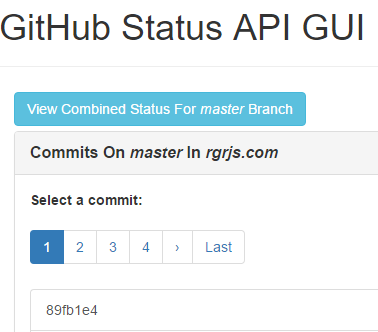

# GitHub Status API GUI

The GitHub Status API GUI is a React/Redux client-side web application which can be used to view and create GitHub commit [statuses](https://developer.github.com/v3/repos/statuses/) in any GitHub repository you have access to. The application uses OAuth to allow users to authenticate to GitHub using their own GitHub usernames and passwords.

## Gatekeeper
In order for OAuth authentication with GitHub to work, you must configure and deploy an instance of the open-source [Gatekeeper](https://github.com/prose/gatekeeper) application to a server. This is due to a security measure GitHub has put in place in it's OAuth authentication API to prevent client-side applications from directly authenticating with GitHub. This restriction ensures that application developers do not inadvertantly disclose their application's GitHub client secret to users by including it in client-side code.

##### Deploying Gatekeeper
You can easily deploy an instance of [Gatekeeper](https://github.com/prose/gatekeeper) directly to Heroku or Azure by clicking the appropriate button in Gatekeeper's [README.md](https://github.com/prose/gatekeeper#deploy-on-heroku) file.

Alternativly, you can clone the Gatekeeper repository and build/deploy Gatekeeper to any web server manually. If you choose this option, make sure you follow the instructions for setting up Gatekeeper in Gatekeeper's [README.md](https://github.com/prose/gatekeeper#setup-your-gatekeeper) file.

## Using OAuth with GitHub
In order for your instance of the GitHub Status API GUI application to authenticate to GitHub using OAuth, you must first [register a new OAuth application](https://github.com/settings/applications/new) for your instance. For more information, see GitHub's [OAuth documentation for developers](https://developer.github.com/v3/oauth/#oauth).
## Known Bugs/Limitations
-   **The commits list page is the only page which currently supports [pagination](https://developer.github.com/v3/#pagination) of data returned from GitHub API.**

    -   For all other views, you can only see the first page of records returned from the GitHub API. By default, the maximum number of records per page of data is 30 (see GitHub issue [#45](https://github.com/compumike08/GitHub_Status_API_GUI/issues/45))

    -   _This is a result of limitations of the library this application uses to interface with the GitHub API. Full support for pagination of all data views in the GitHub Status API GUI application will be added in a future release._
-   **The "View Combined Status" button on the commits list page currently doesn't work.**

    -   _This is because the library used to interface with the GitHub API does not currently support the [combined status endpoint](https://developer.github.com/v3/repos/statuses/#get-the-combined-status-for-a-specific-ref)._

    -   

### License & Copyright
-   [LICENSE](LICENSE)

This project was created using Cory House's [`react-slingshot`](https://github.com/coryhouse/react-slingshot) tool, which is [available under the MIT License](https://github.com/coryhouse/react-slingshot/blob/master/LICENSE).

Copyright &copy; 2017 Michael Hadjiosif
